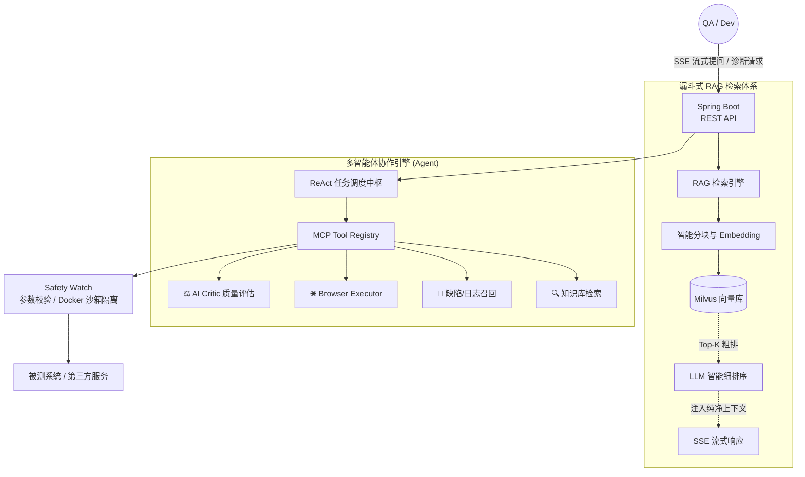

# 企业文档智能检索与多智能体测试辅助平台

> 面向测试知识管理、PRD 理解、测试用例生成、缺陷分析与日志定位场景的 RAG + Agent 智能测试辅助平台。

[](https://openjdk.org/)
[](https://spring.io/projects/spring-boot)
[](https://spring.io/projects/spring-ai)
[](LICENSE)

---

## 项目简介

本项目基于 **Java / Spring Boot / Spring AI** 构建，核心是企业文档 RAG 检索与知识问答系统。在此基础上扩展了测试用例生成、AI Critic 评估、历史缺陷召回、日志检索与 Agent 工具编排 demo 能力。

---

## 项目背景

在软件测试领域，测试人员长期面临以下挑战：

- **PRD 和测试规范文档多**，人工理解与提取测试点耗时
- **测试点容易遗漏**边界值、异常流、权限校验等场景
- **历史缺陷和优质用例难以复用**，经验沉淀在文档中
- **通用大模型缺少企业上下文**，容易生成空泛、不准确的测试用例

因此设计了 RAG + Agent 测试辅助平台，通过检索增强生成让大模型基于企业知识库回答测试相关问题，并结合 Agent 工具编排实现测试用例生成、质量评估与缺陷分析。

---

## 核心功能

### A. 企业文档 RAG 检索
- 文档上传（PDF / Markdown / 纯文本）
- 文档分块（TokenTextSplitter）
- 向量化入库（PGVector）
- Query Rewriting（查询改写提升召回）
- TopK 相似度召回（similarityThreshold=0.5, topK=5）
- 二次过滤（RagFilterService，demo 级）
- 来源引用（检索结果带 source 元数据）
- SSE 流式输出

### B. 智能测试用例生成（demo）
- 输入 PRD / API 文档文本
- 生成结构化测试用例（正常流、异常流、边界值、权限校验）
- 支持 JSON / YAML / Markdown 导出
- 支持人工确认后回流知识库（KnowledgeFeedbackService，demo 级）

### C. AI Critic 智能评估（demo）
- 覆盖率检查（正常流/异常流/边界值/权限）
- 逻辑自洽性检查（步骤完整性、expected 字段）
- 重复用例检测
- 评分与优化建议

### D. Agent 工具编排
- ToolRegistry：注册与白名单管理
- TestAnalysisAgent：编排知识检索、缺陷召回、日志搜索、用例生成、AI 评估
- SafetyWatcher：基础安全检查（危险命令、敏感路径、Prompt Injection 检测）

---

## 技术栈

| 层级 | 技术 |
|------|------|
| 语言 | Java 21 |
| 框架 | Spring Boot 3.5.8 |
| AI | Spring AI 1.1.0（OpenAI-compatible） |
| 向量数据库 | PostgreSQL 16 + PGVector |
| 对话记忆 | JDBC Chat Memory（MessageWindowChatMemory） |
| 构建 | Maven |
| 容器化 | Docker Compose |
| 文档解析 | Spring AI PDF/Markdown Document Reader |

**扩展设计：** Redis 缓存、Milvus 向量库、Playwright 浏览器自动化、Docker 沙箱执行

---

## 系统架构

平台核心由「漏斗式 RAG 检索体系」与「多智能体协作引擎」双基座构成：


---

## 目录结构

```
qa-agent-rag-platform/
├── README.md
├── .gitignore
├── LICENSE
├── pom.xml
├── docker-compose.yml
├── application-example.yml
├── docs/
│   ├── architecture.md
│   ├── rag-pipeline.md
│   ├── test-case-generation.md
│   ├── agent-critic-design.md
│   └── safety-and-desensitization.md
├── sample_data/
│   ├── prd_login_sample.md
│   ├── api_doc_sample.md
│   ├── test_case_sample.json
│   ├── test_case_sample.yaml
│   ├── defect_case_sample.md
│   ├── test_log_sample.log
│   └── evaluation_report_sample.json
├── screenshots/
│   └── .gitkeep
├── scripts/
│   └── run-demo.sh
├── src/
│   ├── main/
│   │   ├── java/com/qaagent/rag/
│   │   │   ├── RAGApplication.java          ← 启动类
│   │   │   ├── config/                        ← ChatClient、Memory 配置
│   │   │   ├── controller/                    ← Chat、Document、OpenAI、DemoTest
│   │   │   ├── service/                       ← Document、TestCaseGen、Export 等
│   │   │   ├── tools/                         ← DocumentTools (@Tool 注解)
│   │   │   ├── agent/                         ← TestAnalysisAgent
│   │   │   ├── evaluator/                     ← AiCriticEvaluator
│   │   │   ├── common/                        ← ToolRegistry、SafetyWatcher
│   │   │   ├── dto/                           ← Request/Response 模型
│   │   │   └── model/                         ← ChatRequest、ChatResponse 等
│   │   └── resources/
│   │       ├── application-example.yml
│   │       └── prompts/
│   └── test/java/com/qaagent/rag/
└── scripts/
```

---

## 本地运行

### 前置条件
- JDK 21
- Docker Desktop
- Maven（或使用 `./mvnw` wrapper）

### 步骤

```bash
# 1. 克隆仓库
git clone <your-repo-url>
cd qa-agent-rag-platform

# 2. 启动 PostgreSQL + PGVector
docker compose up -d

# 3. 配置 API Key
cp src/main/resources/application-example.yml src/main/resources/application.yml
# 编辑 application.yml，设置 AI_API_KEY 和 AI_BASE_URL

# 4. 启动应用
./mvnw spring-boot:run
```

应用运行在 `http://localhost:8080`。

---

## API 示例

### 健康检查

```bash
curl http://localhost:8080/api/health
```

### RAG 检索问答

```bash
curl -X POST http://localhost:8080/api/v2/chat \
  -H "Content-Type: application/json" \
  -d '{"message": "What are the login API error codes?", "useRag": true}'
```

### SSE 流式问答

```bash
curl -N "http://localhost:8080/api/v2/chat/stream?message=Explain+the+authentication+flow"
```

### 文档上传

```bash
curl -X POST http://localhost:8080/api/v2/documents \
  -F "file=@sample_data/api_doc_sample.md"
```

### 测试用例生成（demo）

```bash
curl -X POST http://localhost:8080/api/testcase/generate \
  -H "Content-Type: application/json" \
  -d '{"prdText": "Login API: POST /api/auth/login, returns JWT token on success, 401 on failure"}'
```

### AI Critic 评估（demo）

```bash
curl -X POST http://localhost:8080/api/testcase/evaluate \
  -H "Content-Type: application/json" \
  -d '{"prdText": "...", "testCases": [{"caseId":"1","title":"test","precondition":"","steps":[],"expected":"","priority":"P1","tags":[]}]}'
```

### Agent 分析（demo）

```bash
curl -X POST http://localhost:8080/api/agent/analyze \
  -H "Content-Type: application/json" \
  -d '{"task": "Analyze login defect pattern", "query": "login timeout", "tools": ["knowledge_search", "defect_recall"]}'
```


## 免责声明

本仓库仅用于个人学习、项目展示和求职作品集，不代表任何公司或组织的真实系统。项目中的 demo 模块用于展示设计思路，非生产级实现。

---

## License

MIT License — 详见 [LICENSE](LICENSE)
